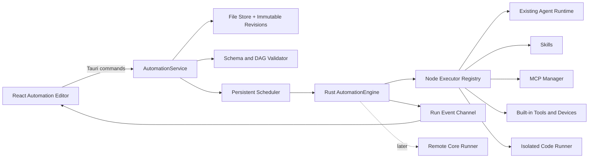

# Automation 功能设计与开发规划

> 状态：设计提案  
> 日期：2026-07-21  
> 适用范围：`desktop/` 主线，不在首版直接修改 `server/`

## 当前落地状态

截至 2026-07-21，首轮已完成 M0 与 M1 的可用骨架：

- 已落地 `shared/automation/v1` 工作流与节点定义 Schema、示例流程。
- 已落地 Rust 模型、DAG/发布校验、本地原子化草稿存储和 Tauri Commands。
- 已落地独立 Automation 列表页、浮动节点库、React Flow 画布、连线、浮动属性面板、600 ms 自动保存和发布前检查。
- 已提供手动/定时触发、Model、Agent、Skill、MCP、内置工具、Code、Condition、Merge、Approval、Output 的草稿节点定义。
- “测试”和正式“发布”仍保持禁用语义；执行引擎、运行记录、不可变版本、调度器和代码沙箱从 M2/M3 开始实现。
- M1 后续还需补齐撤销/重做、复制/粘贴、类型化变量选择器与 100 节点性能基准。

## 1. 前提与结论

公开资料中的 Replicated KOTS 是 Kubernetes 应用安装与管理产品，不是与 n8n、Dify 同类的可视化工作流编排器。结合本需求语境，本方案暂将“Kots”理解为“扣子 Coze Studio”。如果指的是另一个具体项目，只需重做竞品差异表，不影响下述核心架构。

产品结论：Automation 应定位为“本地优先的 Agent 自动化工作台”，而不是复刻 n8n 的 SaaS 连接器市场。它的首要差异化是：

- 将现有 Agent、Skills、MCP、内置工具和设备能力组合成可复用流程。
- 用显式的节点输入/输出、权限和执行记录，补足纯 Agent 对话的不确定性。
- 默认本地执行，后续通过统一 Runner 协议选择远程 Core，不让画布和调度器绑死。
- 先支持模式化自定义节点，不在首版允许任意 React UI 代码注入主进程。

## 2. 开源项目借鉴

| 项目 | 建议借鉴 | 不直接复制 |
| --- | --- | --- |
| n8n | 节点搜索与分类、连线处快速插入、数据映射、样例数据固定、执行历史筛选、使用原始/当前版本重试、子工作流、自定义节点 | 不复制庞大的连接器市场和企业级多租户权限 |
| Dify | AI 优先的节点集、类型化变量选择、单节点/整流调试、人工输入暂停与恢复、触发器统一输入、发布版本和运行追踪 | 不把每个流程强制建模成对话应用，不在首版引入知识库平台 |
| Coze Studio | DAG 中同时表达数据流和控制流、强输入/输出契约、可扩展节点注册表、画布引擎与业务节点解耦 | 不直接移植 Coze 的业务服务和大型前端 monorepo |

相关一手资料：[n8n 官方文档](https://docs.n8n.io/)、[n8n 数据映射](https://docs.n8n.io/data/data-mapping/data-mapping-ui/)、[n8n 执行历史](https://docs.n8n.io/workflows/executions/all-executions/)、[n8n 自定义节点](https://docs.n8n.io/integrations/creating-nodes/overview/)、[Dify Workflow Studio](https://www.dify.ai/workflows)、[Dify Workflow 入门](https://docs.dify.ai/en/guides/application-orchestrate/creating-an-application)、[Dify Trigger Plugin](https://docs.dify.ai/en/develop-plugin/dev-guides-and-walkthroughs/trigger-plugin)、[Coze Studio 源码](https://github.com/coze-dev/coze-studio)、[Coze 前端自定义节点](https://github.com/coze-dev/coze-studio/wiki/10.-Add-new-workflow-node-types-%28frontend%29)、[Coze 后端自定义节点](https://github.com/coze-dev/coze-studio/wiki/11.-Add-new-workflow-node-types-%28backend%29)。

## 3. 信息架构

Automation 沿用当前 `ProductArea = "automations"` 一级分区。左侧全局侧边栏保留 Product Area Switcher 和底部设置，中间内容根据当前分区切换为：

| 导航 | 内容 | 优先级 |
| --- | --- | --- |
| 概览 | 近期运行、失败与等待审批、快速新建 | P0 |
| 工作流 | 搜索、标签、启用状态、触发方式、下次运行时间 | P0 |
| 运行记录 | 按流程、状态、触发源和时间筛选 | P0 |
| 模板 | 内置模板、导入/导出、从模板创建 | P1 |
| 组件 | 内置与已安装自定义节点、版本和权限 | P2 |

### 3.1 列表页

```text
┌─全局侧边栏 256px─┐┌─主内容──────────────────────────────────┐
│ Product Area       ││ Automations       [搜索] [从模板] [＋新建]│
│ ＋ 新建工作流     │├────────────────────────────────────────┤
│ 概览               ││ 运行中  2    等待审批  1    近7日失败  3  │
│ 工作流           ││ [全部] [已发布] [草稿] [已停用] [标签筛选]   │
│ 运行记录         ││ 名称 | 触发器 | 状态 | 下次运行 | 最近结果    │
│ 模板               ││ ...                                         │
│                    ││                                             │
│ 设置               ││                                             │
└────────────────────┘└────────────────────────────────────────────┘
```

默认使用可扫读的表格/列表，而不是大面积卡片墙。无数据时显示三个明确入口：空白工作流、从模板创建、使用自然语言生成（P2）。

### 3.2 编辑器

```text
┌─Product Area / 全局设置────────────────────────────────────────────────────┐
├─返回 / 流程名 / 保存状态              [添加节点] [设置] [发布检查]──────────┤
│                                                                            │
│      ┌─按需浮出的节点库─┐        可无限平移/缩放的画布       ┌─配置浮层─┐   │
│      │ 搜索 / 分类       │   [开始] ──》 [Agent] ──》 [输出]   │ 节点配置 │   │
│      │ 拖到目标位置      │                                  │ 输入映射 │   │
│      └──────────────────┘                                  └──────────┘   │
│                                                                            │
├─可折叠运行抽屉：时间线 | 节点输入 | 节点输出 | 日志 | 错误────────────────┤
└────────────────────────────────────────────────────────────────────────────┘
```

Automation 不复用 Workspace 的常驻侧边栏。节点库和属性面板覆盖在画布之上、互斥显示且可随时关闭，不通过挤压画布换取配置空间；窄窗口下浮层宽度受视口约束。底部执行抽屉最高占内容区 50%。

## 4. 核心交互

### 4.1 创建与编辑

- 点击“新建”先选空白、模板或 AI 生成，然后立即进入草稿画布。
- 添加节点支持三条路径：左侧节点库拖入，点击连线端点后搜索，点击连线中的 `+` 插入。
- 节点卡片只展示名称、类型、关键配置摘要和运行状态；完整表单在按需浮出的配置面板编辑。
- 节点拖动只修改视图位置，不影响执行顺序；执行顺序仅由连线和端口决定。
- 端口按 JSON Schema 类型校验，不兼容的连线不落盘，并在右侧显示可操作的修复原因。
- 首版禁止任意回边产生环。循环必须由受控的 Loop 节点表达，并强制最大迭代数。
- 草稿在操作停止后 600 ms 自动保存，顶栏显示“保存中 / 已保存 / 保存失败”；发布不等于保存。
- 编辑历史保留至少 100 步撤销/重做，一次拖动仅记一步。

### 4.2 变量与数据映射

- 节点间统一传递 JSON Value，文件用受控 `ArtifactRef` 表示，不在事件和日志中嵌入大文件。
- 参数来源支持 `literal`、`triggerInput`、`nodeOutput`、`secretRef` 四种结构化绑定。
- 用户从“上游节点 > 输出字段”选择器中绑定数据，高级用户可查看对应 JSON Pointer。
- 首版不提供任意内联 JavaScript 表达式；复杂变换用 Code 节点表达，避免再维护一套隐式表达式运行时。
- 调试时可固定某节点样例输出；固定数据只对草稿调试生效，发布前必须显式移除或确认。

### 4.3 调试、发布与执行历史

- “测试流程”先展示触发输入表单，然后打开底部执行抽屉。
- 执行中节点显示 `queued/running/waiting/succeeded/failed/skipped/cancelled` 状态，颜色与图标同时表意。
- 点击节点后，抽屉跳转到该次 Node Run，分页显示输入、输出、日志、耗时、Token/费用和错误。
- “测试此节点”使用最近一次上游输出或固定样例数据；数据不足时列出缺失项，不猜测。
- 发布时先运行结构、参数、凭据引用和无人值守权限检查，生成不可变的 Published Revision。
- 新草稿不影响已发布版本和正在执行的 Run。
- 历史记录可查看当时的流程快照，并支持“用原版本重试”和“用当前草稿与原输入重试”。

### 4.4 键盘和无障碍

| 操作 | 快捷键 |
| --- | --- |
| 搜索并添加节点 | `Cmd/Ctrl + K` |
| 保存草稿 | `Cmd/Ctrl + S` |
| 测试流程 | `Cmd/Ctrl + Enter` |
| 撤销 / 重做 | `Cmd/Ctrl + Z` / `Cmd/Ctrl + Shift + Z` |
| 复制节点 | `Cmd/Ctrl + D` |
| 适应画布 | `F` |
| 删除选中 | `Backspace/Delete` |

所有画布操作必须提供非拖拽替代路径。节点可通过键盘选中、移动、连接和删除；视觉状态不得只依赖颜色。

## 5. 节点体系

### 5.1 MVP 节点

| 类别 | 节点 | 执行语义 |
| --- | --- | --- |
| 触发 | 手动触发、定时触发 | 每个流程有且仅有一个启用触发器 |
| AI | Model | 稳定的单次模型调用，支持结构化输出 |
| AI | Agent | 复用现有 Agent 档案和工具循环 |
| AI | Skill | 本质是选定一个 Skill 的受限 Agent 步骤，不把 Markdown Skill 伪装成确定性函数 |
| 工具 | MCP Tool | 不经 LLM，直接调用某个 MCP Server 的具体 Tool |
| 工具 | Built-in Tool | 调用文件、Fetch、Device 等现有内置工具 |
| 变换 | Code | 运行受限 JavaScript，输入和输出必须为 JSON/ArtifactRef |
| 逻辑 | Condition、Merge | 显式分支和汇合，Merge 支持 all/any |
| 人工 | Approval | 持久化暂停，等待通过、拒绝或超时路径 |
| 终止 | Output | 定义 Run 的结构化最终输出 |

P1 增加 Webhook/Device Event 触发、HTTP Request、Delay、Loop、Subflow 和 Error Handler。P2 增加自定义节点包和 AI 生成流程。

### 5.2 节点定义注册表

画布、表单和运行时不能各自硬编码节点。每个节点类型通过统一 `NodeDefinition` 注册：

```ts
interface NodeDefinition {
  type: string;
  version: number;
  category: "trigger" | "ai" | "tool" | "transform" | "logic" | "human" | "output";
  title: string;
  description: string;
  configSchema: JsonSchema;
  inputSchema: JsonSchema;
  outputSchema: JsonSchema;
  capabilities: string[];
  executionMode: "local" | "remote" | "either";
}
```

同一定义驱动节点库、shadcn 表单、端口、发布校验、权限清单和 Rust Executor 查找。工作流锁定 `type + version`，节点升级通过显式 migration 完成。

### 5.3 自定义组件边界

自定义组件分三级交付：

| 级别 | 方式 | 安全边界 | 阶段 |
| --- | --- | --- | --- |
| L1 | 将一组节点保存为 Subflow/模板 | 不引入新代码 | P1 |
| L2 | 用 Manifest + JSON Schema 定义 HTTP/MCP/JavaScript 节点包 | 表单由主程序生成，代码在独立 Runner 运行 | P2 |
| L3 | 可自定义节点 UI | 仅允许签名、受信任组件，在隔离 WebView 运行 | 后续 |

L2 建议包格式：

```text
example.ttz-node/
├── manifest.json
├── README.md
├── icon.png
├── schemas/
│   ├── config.schema.json
│   ├── input.schema.json
│   └── output.schema.json
└── runtime/
    └── main.js
```

Manifest 必须声明节点 ID、版本、最低应用版本、权限、入参/出参 Schema 和运行时类型。凭据只能使用 `credentialRef`，不能写入节点包或工作流 JSON。

## 6. 数据模型

稳定协议放在 `shared/automation/v1/`，作为 TypeScript、Rust 和未来远程 Core 的单一事实源。不直接序列化画布库的私有类型。

```ts
interface AutomationDocument {
  schemaVersion: 1;
  id: string;
  name: string;
  description: string;
  revision: number;
  nodes: AutomationNode[];
  edges: AutomationEdge[];
  settings: {
    timezone: string;
    maxDurationMs: number;
    maxConcurrency: number;
    onMissedSchedule: "skip" | "runLatest";
  };
  createdAt: number;
  updatedAt: number;
}

interface AutomationNode {
  id: string;
  type: string;
  typeVersion: number;
  name: string;
  position: { x: number; y: number };
  disabled: boolean;
  config: unknown;
  inputs: Record<string, ValueBinding>;
}

interface AutomationEdge {
  id: string;
  sourceNodeId: string;
  sourcePort: string;
  targetNodeId: string;
  targetPort: string;
}
```

Run 单独引用不可变的工作流快照，至少保存 `runId`、`automationId`、`revision`、`trigger`、`status`、`startedAt`、`finishedAt`、`nodeRuns`、`input`、`output`、`error`。Node Run 保存尝试次数、状态、时间、结构化输入/输出摘要和日志引用。

## 7. 执行架构



### 7.1 Rust 模块

```text
desktop/src-tauri/src/automation/
├── mod.rs
├── model.rs
├── store.rs
├── validate.rs
├── engine.rs
├── events.rs
├── registry.rs
├── scheduler.rs
├── approval.rs
└── nodes/
```

`AutomationEngine` 执行经校验的 DAG：依赖全部完成的节点进入 ready queue，在流程并发限制内启动，任一节点的重试、超时、取消和错误路由均由引擎管理，不分散到 UI。

### 7.2 对现有能力的复用与重构

- 将 `agent::run_agent_loop` 封装为可被 Chat 和 Automation 共用的 Agent Runtime，避免 Automation 调用 Chat command。
- 将 `tools::specs` 中的名称、描述和 JSON Schema 抽为中立 `ToolDefinition`，同时驱动 LLM function calling 和 Built-in Tool 节点。
- 直接复用 `McpManager::list_tools/call_tool`，但将 MCP 输出优先保留为结构化 JSON，文本仅作兼容层。
- 复用 Skills 存储和校验；Skill 节点使用发布时锁定的 Skill 名与内容哈希，运行时发现变更则按策略警告或阻断。
- 不直接复用 `server/internal/cron/`。现有 Go Cron 执行的是单个 Agent Prompt，没有 DAG、版本、节点日志和持久化审批语义，强行复用会形成两套事实源。
- 从首版定义 `RunnerTarget::Local | RemoteCore` 协议，但只实现 Local；后续远程 Core 不改工作流 JSON。

### 7.3 存储

沿用当前文件型本地持久化，首版不引入数据库：

```text
app_data_dir()/automations/
├── index.json
└── {automation_id}/
    ├── draft.json
    ├── versions/{revision}.json
    └── runs/{run_id}/
        ├── run.json
        ├── events.jsonl
        └── artifacts/
```

写入必须使用临时文件 + atomic rename，并在 Rust 服务层串行化同一 Automation 的草稿保存。默认保留 30 天或最近 500 次 Run，等待审批、置顶或手动保留的 Run 不自动清理。

### 7.4 前端模块

```text
desktop/src/features/automations/
├── automations-page.tsx
├── automation-list.tsx
├── automation-editor.tsx
├── automation-canvas.tsx
├── node-library.tsx
├── node-inspector.tsx
├── variable-picker.tsx
├── execution-drawer.tsx
└── nodes/
desktop/src/stores/automations.ts
desktop/src/lib/automation.ts
```

建议在短期技术尖刺后使用 [`@xyflow/react`](https://reactflow.dev/) 作为领域画布引擎：它提供拖拽、平移、缩放、多选、连线和键盘基础能力，节点本身仍由 React + shadcn/ui + Tailwind 实现。它是画布引擎，不用来替换当前 UI 组件体系。不建议首版引入 FlowGram：它与 Coze 场景更贴合，但抽象和样式层更重，对当前小型 Tauri 前端的改造面更大。

技术尖刺验收：Safari 16.4/WKWebView 基线下 100 节点可流畅平移缩放，自定义节点可用 Tailwind 完成，深浅主题正常，库的基础样式导入不需要新建业务 CSS 文件。任一项不满足再评估自研 SVG/HTML 画布。

## 8. 权限、凭据与沙箱

- 工作流和日志不保存密钥明文，仅保存 `credentialRef`；凭据放入系统安全存储。
- 发布页生成“所需权限清单”，区分读、写、网络、进程、设备和凭据。
- 前台手动运行可复用询问/自动/完全授权概念，但 PermissionBroker 需从 Chat `request_id` 模型重构为通用 Execution Scope。
- 定时等无人值守运行不得隐式继承“完全授权”。发布时必须为高风险节点选择“预授权 / 暂停等待 / 立即失败”。
- Approval 是持久化业务节点，与临时 Tool Permission 不是同一概念；应用重启后仍可恢复等待中的 Approval。
- Code 节点在独立 Runner 进程中执行，默认无文件系统、无网络、无环境变量，只有受限时间、内存和 JSON I/O。
- MCP stdio 本身可启动本地进程；流程发布时要锁定 Server ID + Tool Name，并对工具变更重新评估权限。
- 执行输入、输出和日志统一经过尺寸上限、敏感字段脱敏和保留策略。

本地定时触发的产品限制必须明示：应用未运行、操作系统休眠或网络不可用时，不能保证准点执行。首版采用 `skip` 或 `runLatest` 的错过调度策略；需要 24/7 运行时选择远程 Core。

## 9. 实施路线

下述估算以 1 名熟悉当前仓库的全职工程师为基准，不包含大量视觉资产和远程 Core 改造。

### M0：契约与技术尖刺（3–5 个工作日）

- 确认 `Kots` 参考对象。
- 完成 `shared/automation/v1` JSON Schema 和工作流样例。
- 完成 `@xyflow/react` 在 Tauri WKWebView、Tailwind、深浅主题下的画布尖刺。
- 冻结 MVP 节点集、DAG 语义、数据绑定和权限模型。

验收：协议可序列化/反序列化，示例流程可通过 Rust 校验器，100 节点画布达到可用性基线。

### M1：管理页与画布草稿（1.5–2 周）

- 实现 Automation 动态侧边栏、列表页、空状态和新建/重命名/归档。
- 实现节点库、画布、连线校验、属性面板和变量选择器。
- 实现草稿持久化、自动保存、撤销/重做、复制/粘贴和发布前静态校验。

验收：可完成一条不执行的流程草稿，重启应用后图结构、位置和配置不丢失。

### M2：可执行 MVP（2–3 周）

- 实现 Rust AutomationService、Store、Validator、Engine、Event Channel 和取消。
- 实现手动触发、Model、Agent、Skill、MCP Tool、Built-in Tool、Condition、Merge 和 Output。
- 重构 Agent Runtime 和 ToolDefinition 以复用现有能力。
- 实现执行抽屉、实时节点状态、输入/输出/日志查看、失败与取消。

验收：可手动执行“输入 -> Skill/Agent -> MCP -> Condition -> Output”，一次 Run 的每个节点都有可审计记录。

### M3：Code、审批、定时与发布（2 周）

- 实现独立 JavaScript Runner 和 Code 节点。
- 实现 Approval 持久化暂停/恢复、超时路由和应用内待办。
- 实现 Published Revision、启用/停用、定时调度、错过执行策略和重启恢复。
- 实现执行历史筛选、版本快照查看和原版本/当前版本重试。

验收：发布后修改草稿不影响定时运行；应用重启后能恢复等待审批的 Run；Code 超时、超内存和越权访问都被中止。

### M4：模板、子流程与自定义组件（2 周）

- 实现工作流导入/导出、内置模板和 Subflow。
- 实现 L2 节点包的 Manifest、校验、安装、禁用、版本锁定和卸载阻断。
- 增加 HTTP Request、Webhook/Device Event、Loop 和 Error Handler。

验收：流程可在两个安装之间导出/导入，缺失的凭据和节点组件可被精确识别，不会静默替换。

### M5：AI 生成与远程执行（后续）

- 自然语言先生成受 Schema 约束的草稿，在画布上显示 diff，用户确认后再落盘。
- 模型不能生成密钥或自动授权，缺失资源以 unresolved placeholder 表示。
- 实现 RemoteCore Runner，将发布快照、凭据引用、权限和运行事件纳入 `shared/automation` 协议。

## 10. 测试与质量门槛

| 层级 | 必测内容 |
| --- | --- |
| Rust 单元测试 | Schema 迁移、DAG 环检测、端口校验、ready queue、并发限制、重试、超时、取消、错过调度 |
| Rust 集成测试 | 使用 Fake Executor 跑串行/并行/分支流，测试重启恢复和审批续跑 |
| 前端单元测试 | 图编辑 reducer、撤销/重做、自动保存合并、连线校验、变量绑定 |
| 端到端 | 新建 -> 编辑 -> 测试 -> 发布 -> 定时执行 -> 查看历史 -> 重试 |
| 安全 | 凭据不落盘、日志脱敏、Code 逃逸、MCP 工具变更、无人值守权限绕过 |
| 性能 | 100 节点编辑、50 个 ready node 的调度、1000 条运行记录的分页和筛选 |

发布门槛：`pnpm typecheck`、`pnpm build`、`cargo check`、`cargo test` 全部通过；macOS WKWebView 和 Windows WebView2 均完成核心路径手动回归。

## 11. 首版验收范围

MVP 完成标准：

- 用户可创建、复制、归档、删除 Automation，草稿可靠恢复。
- 可视化连接手动/定时触发、Model/Agent/Skill、MCP、内置工具、Code、Condition/Merge、Approval 和 Output。
- 可绑定上游输出、校验类型，并调试单节点或整条流程。
- 可发布不可变版本，定时任务在应用运行期间触发已发布版本。
- 可查看任意 Run 的节点级输入、输出、状态、耗时、日志和错误，并可取消或重试。
- 所有工具调用在节点配置和 Rust 执行时双重校验，不因模型构造参数绕过权限。
- 工作流 JSON、导出包和运行日志中不出现明文凭据。

## 12. 不纳入首版

- 多人实时协同编辑、RBAC 和企业组织空间。
- 对齐 n8n 的大量 SaaS 连接器和市场。
- 任意第三方 React 节点 UI 直接注入主 WebView。
- 应用退出后仍由本地桌面端保证 24/7 调度。
- 任意图环和无上限循环。
- 直接执行用户未审查的 AI 生成流程。
